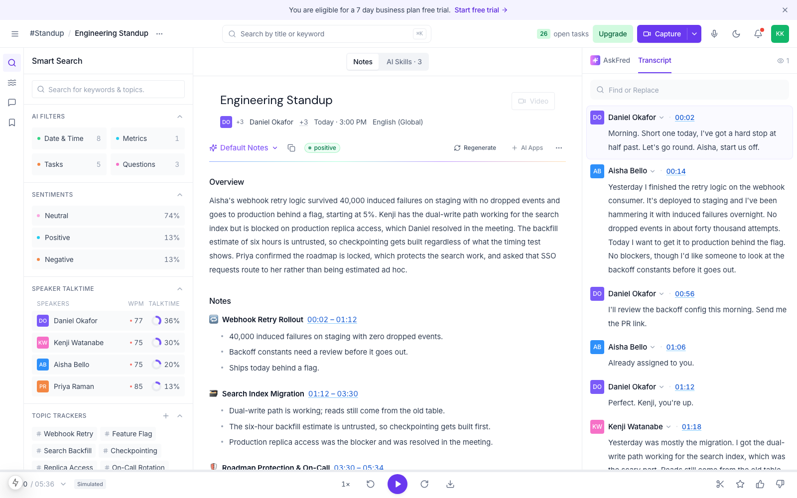
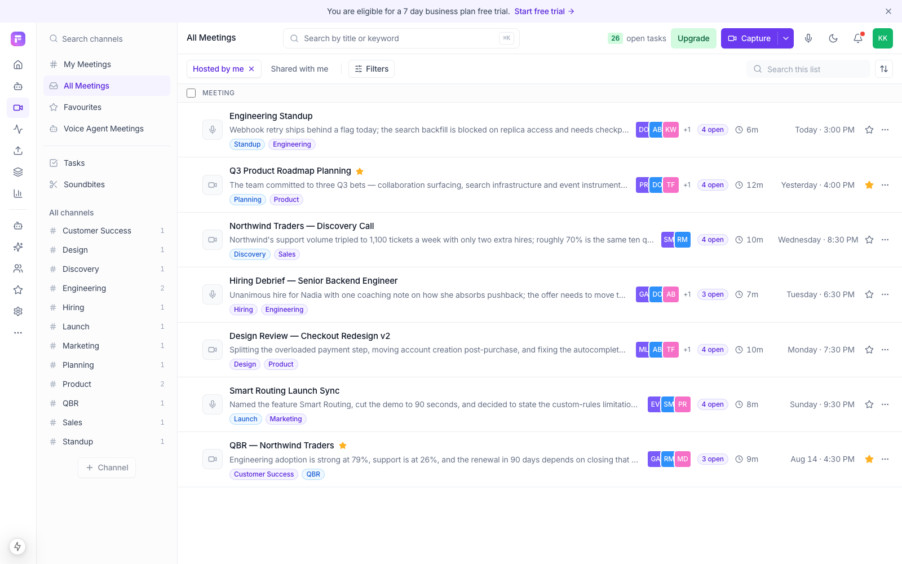
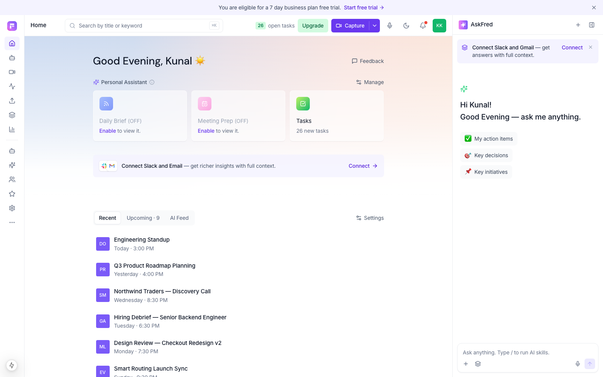
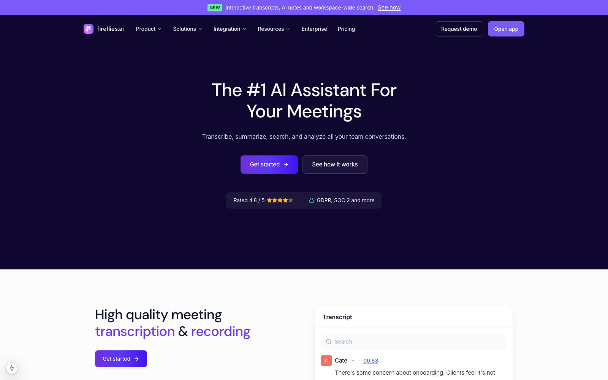
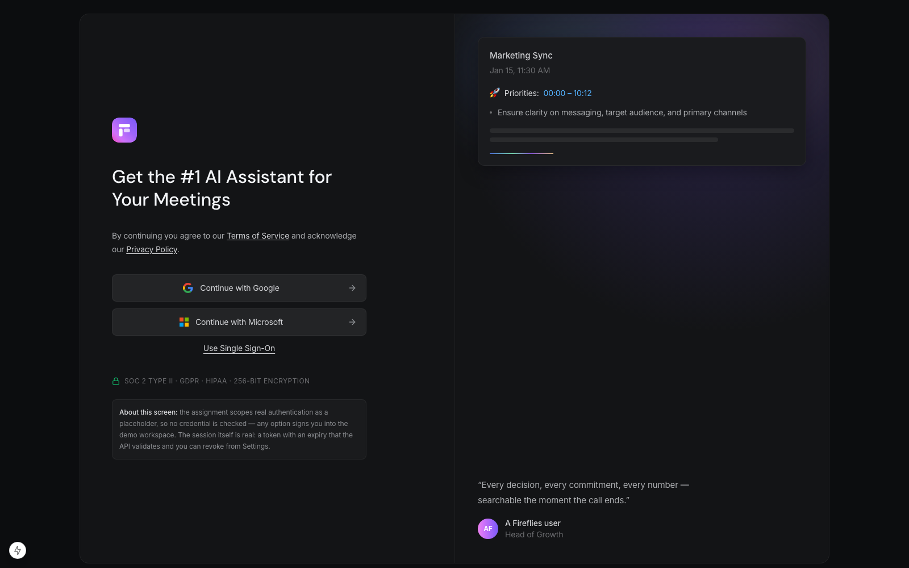

# Fireflies.ai Clone — Meeting Notes & Transcription Platform

A working clone of the Fireflies.ai meeting-assistant web app: a library of past
meetings, an interactive transcript wired to a media player, AI-generated
summaries with chapters and action items, and full-text search across every
meeting.

Real speech-to-text is out of scope. Transcripts are seeded or uploaded, and AI
notes come from a deterministic extractive summariser built into the backend —
or from Claude, if an API key is configured. Everything else is real: the data
persists, the search index is real FTS5, and every CRUD path works.

<p align="center">
  
  <br><em>The meeting view — notes, transcript and player, inside the four-column shell.</em>
</p>

<p align="center">
  
  
  <br>
  
  
  <br><em>Library · Home · the public landing page · sign in. More in <a href="docs/screenshots">docs/screenshots</a>.</em>
</p>

---

## Contents

- [Quick start](#quick-start)
- [Routes](#routes)
- [Tech stack](#tech-stack)
- [Architecture](#architecture)
- [Database schema](#database-schema)
- [API overview](#api-overview)
- [Features](#features)
- [How the AI notes work](#how-the-ai-notes-work)
- [Transcript formats](#transcript-formats)
- [Tests](#tests)
- [Deployment](#deployment)
- [Assumptions and scope](#assumptions-and-scope)

---

## Quick start

Requirements: **Python 3.11+** and **Node 18+**.

### 1. Backend

```bash
cd backend
python3 -m venv .venv && source .venv/bin/activate
pip install -r requirements.txt
uvicorn app.main:app --reload --port 8000
```

On first boot the app creates `backend/fireflies.db`, builds the FTS index and
seeds seven sample meetings with full transcripts, notes and action items. No
extra step is needed.

- API: <http://localhost:8000/api/health>
- Interactive docs: <http://localhost:8000/docs>

### 2. Frontend

```bash
cd frontend
npm install
cp .env.example .env.local        # NEXT_PUBLIC_API_URL=http://localhost:8000
npm run dev
```

Open <http://localhost:3000>. The landing page is public; **Open app** takes you
to the login screen, and any provider signs you into the seeded workspace.

---

## Routes

The app mirrors the real product's URLs, so the structure is recognisable to
anyone who has used it. `/` is the one deliberate difference — that is the public
marketing page here, so the app home lives at `/home`.

| Path | Screen | Auth |
|---|---|---|
| `/` | Marketing landing page | public |
| `/login` | Sign in | public |
| `/home` | Home dashboard | required |
| `/notebook/mine-shared` · `/all` · `/favorites` · `/autopilot` | Meetings library | required |
| `/view/{id}` | Meeting detail — notes, transcript, player | required |
| `/search` · `/tasks` · `/soundbites` · `/upload` · `/analytics` | Workspace surfaces | required |
| `/ask-fred` · `/skills` · `/status` · `/agents` · `/integrations` · `/team` · `/upgrade` · `/settings` | Assistant, placeholders and settings | required |

Anything that requires auth is enforced in `middleware.ts` at the edge, so a
signed-out visitor is redirected before any app UI renders.

### Reseeding

```bash
cd backend
python -m app.seed.seed --reset      # rebuild with the authored sample notes
python -m app.seed.seed --reset --generate   # rebuild, generating notes instead
```

`--generate` runs the same summariser an upload would, which is a quick way to
see the difference between the authored fixtures and machine-generated notes.

---

## Tech stack

| Layer | Choice | Why |
|---|---|---|
| Frontend | Next.js 15 (App Router), React 19, TypeScript | Required stack; the App Router keeps each surface a self-contained route |
| Styling | Tailwind CSS 3.4 | The theme *is* Fireflies' own token set — see [design notes](docs/design-notes.md) |
| Data fetching | TanStack Query v5 | Cache keys + invalidation give optimistic-feeling CRUD without hand-rolled state |
| Icons | lucide-react | Closest open equivalent to the icon set Fireflies uses |
| Backend | FastAPI + Pydantic v2 | Typed request/response models, and free OpenAPI docs |
| ORM | SQLAlchemy 2.0 (typed `Mapped[...]`) | Explicit relationships and cascades |
| Database | SQLite + **FTS5** | Required; FTS5 makes search a real ranked index rather than a `LIKE` scan |
| Tests | pytest + FastAPI `TestClient` | 98 tests over the parser, summariser, search, auth and the whole API |

No state-management library, no component library, no CSS-in-JS. Every component
in `frontend/components/` is written for this project.

---

## Architecture

```
┌──────────────────────── frontend (Next.js) ─────────────────────────┐
│  middleware.ts            edge session guard                        │
│  app/                     one route per surface                     │
│    (public)               / landing · /login                        │
│    home/                  dashboard                                 │
│    notebook/[view]/       meetings library (4 views)                │
│    view/[id]/             meeting detail (notes + transcript)       │
│    search · tasks · soundbites · upload · analytics · settings      │
│  components/                                                        │
│    ui/                    Button, Modal, Toast, Dropdown, …         │
│    layout/                AppShell, IconRail, ChannelSidebar,       │
│                           ContentTopbar, AskFredPanel, providers    │
│    meetings/              library rows, create/edit modals          │
│    meeting/               player bar, transcript, notes,            │
│                           SmartSearchPanel, side panels             │
│  lib/                     typed API client · session · hooks        │
└──────────────────────────────┬──────────────────────────────────────┘
                               │ JSON over HTTP
┌──────────────────────────────┴──────── backend (FastAPI) ───────────┐
│  routers/    auth · meetings · notes · action_items ·               │
│              engagement · search · workspace                        │
│  services/   transcript_parser · summarizer · search ·              │
│              meeting_builder · insights                             │
│  models.py   SQLAlchemy ORM      schemas.py  Pydantic I/O           │
│  serializers.py  ORM → response shapes                              │
│  seed/       fixtures + seeding CLI                                 │
└──────────────────────────────┬──────────────────────────────────────┘
                               │
                    SQLite (tables + FTS5 virtual table)
```

### The ideas worth knowing

**One ingest path.** `services/meeting_builder.attach_transcript()` is the only
code that turns a transcript into a meeting. The upload endpoint, the paste
endpoint and the seeder all call it, so a seeded meeting and an uploaded one are
the same kind of object — there is no special-case seeding code to drift.

**Everything anchors to a millisecond offset.** Segments, chapters, action
items, comments and soundbites all carry a `*_ms`. That single decision is what
makes click-a-line-to-seek, follow-along highlighting, jump-to-chapter and
jump-to-commitment all fall out of one model instead of four features.

**Layers stay thin.** Routers do HTTP concerns; services hold the logic;
`serializers.py` owns the ORM→response mapping so the list view and the detail
view can never disagree about what a meeting looks like.

**Degradation is designed, not accidental.** No Anthropic key → the extractive
summariser. Not SQLite → search falls back to a `LIKE` scan. No media file →
the player runs a real transport against the transcript timeline. The app never
hard-fails because an optional dependency is absent.

---

## Database schema

```
users ──1:N──> sessions
users ──1:N──> meetings
                 │
                 ├─1:N─> participants ──1:N─> transcript_segments
                 ├─1:N─> transcript_segments      (speaker_id → participants)
                 ├─1:1─> summaries
                 ├─1:N─> topics
                 ├─1:N─> action_items             (assignee_id → participants)
                 ├─1:N─> comments                 (segment_id → transcript_segments)
                 ├─1:N─> soundbites
                 └─M:N─> tags   (through meeting_tags)

transcript_fts  — FTS5 virtual table over (text, speaker_name)
```

| Table | Purpose | Notable columns |
|---|---|---|
| `users` | The workspace owner | `email` (unique), `timezone` |
| `sessions` | A signed-in browser | token as PK, `provider`, `expires_at`, `revoked_at` |
| `meetings` | One recorded meeting | `meeting_date`, `duration_seconds`, `source`, `media_url`, `media_type`, `status`, `is_favorite`, `privacy` |
| `participants` | Who was on the call | `speaker_label` (the raw transcript label), `talk_time_seconds`, `color`, `is_host` — unique on `(meeting_id, speaker_label)` |
| `transcript_segments` | One spoken turn | `start_ms`, `end_ms`, `text`, `speaker_id`, `speaker_name` |
| `summaries` | AI notes, 1:1 with a meeting | `gist`, `overview`, `bullet_points` (JSON), `keywords` (JSON), `questions` (JSON), `sentiment`, `generated_by` |
| `topics` | Chapters / outline | `title` (emoji-prefixed), `bullets` (JSON), `start_ms`, `end_ms` |
| `action_items` | Extracted commitments | `assignee_id`, `status`, `priority`, `due_date`, `timestamp_ms`, `source` (`ai` \| `manual`) |
| `comments` | Notes on a meeting or a line | `segment_id`, `timestamp_ms` |
| `soundbites` | Clipped highlights | `start_ms`, `end_ms`, `transcript_excerpt` |
| `tags` / `meeting_tags` | Free-form labels | many-to-many |

### Schema decisions

- **UUID-hex string primary keys.** Ids appear in URLs; autoincrement integers
  would leak how many meetings exist and make ids guessable.
- **`speaker_name` is denormalised onto every segment.** A segment must still
  render if its participant row is removed, and it lets the FTS index carry the
  speaker without a join. Renaming a participant rewrites the denormalised copy
  *and* reindexes the affected rows — see `PATCH /participants/{id}`.
- **`speaker_label` is separate from `name`.** The transcript may say
  `Speaker 1`; the roster says `Priya Raman`. Keeping both means a rename never
  breaks the mapping back to the raw file.
- **`action_items.source`.** Regenerating notes deletes and rebuilds the
  AI-derived items, but must never throw away something a person typed or
  completed. Provenance is what makes that safe.
- **JSON columns for bullet lists.** `bullet_points`, `keywords`, `bullets` are
  ordered lists that are always read whole and never queried into — a child
  table would add joins and buy nothing.
- **`ON DELETE CASCADE` plus `PRAGMA foreign_keys=ON`.** Deleting a meeting
  removes every child row. The FTS table isn't covered by FK cascade, so it is
  purged explicitly in the delete route (and there's a test for exactly that).

---

## API overview

All routes are under `/api`. Full interactive docs at `/docs`.

### Auth

| Method | Path | Description |
|---|---|---|
| `POST` | `/auth/session` | Sign in; returns a bearer token and its expiry |
| `GET` | `/auth/session` | Who this token belongs to, and whether it is still valid |
| `DELETE` | `/auth/session` | Sign out — revokes the token (idempotent) |
| `GET` | `/auth/sessions` | Active sessions for the current user |

### Meetings

| Method | Path | Description |
|---|---|---|
| `GET` | `/meetings` | List with `q`, `participant`, `tag`, `date_from`, `date_to`, `favorite`, `source`, `sort`, `page`, `page_size` |
| `POST` | `/meetings` | Create — optionally from a pasted transcript |
| `POST` | `/meetings/upload` | Create from an uploaded `.txt` / `.vtt` / `.srt` / `.json` file |
| `GET` | `/meetings/{id}` | Full detail: segments, summary, topics, action items, comments, soundbites |
| `PATCH` | `/meetings/{id}` | Update title, date, tags, privacy |
| `DELETE` | `/meetings/{id}` | Delete, cascading to children and the search index |
| `POST` | `/meetings/{id}/favorite` | Toggle favourite |
| `GET` | `/meetings/{id}/export?format=md\|txt\|json` | Download |

### Transcript & participants

| Method | Path | Description |
|---|---|---|
| `GET` | `/meetings/{id}/transcript` | Segments in time order |
| `GET` | `/meetings/{id}/transcript/search?q=` | Ranked matches with snippets |
| `PATCH` | `/meetings/{id}/transcript/{segment_id}` | Correct text or reassign the speaker |
| `GET/POST` | `/meetings/{id}/participants` | Read / add |
| `PATCH/DELETE` | `/meetings/{id}/participants/{pid}` | Rename (rewrites their lines) / remove |

### Notes & action items

| Method | Path | Description |
|---|---|---|
| `GET/PATCH` | `/meetings/{id}/summary` | Read / hand-edit |
| `POST` | `/meetings/{id}/summary/regenerate` | Rebuild notes, preserving manual and completed items |
| `GET/POST/DELETE` | `/meetings/{id}/topics` | Chapters |
| `GET` | `/meetings/{id}/insights` | Entity filters, sentiment split, talk time and WPM |
| `GET` | `/tasks?status=&assignee=&q=` | Every action item across the workspace |
| `GET/POST` | `/meetings/{id}/action-items` | Read / add |
| `PATCH/DELETE` | `/action-items/{id}` | Edit, complete, reassign, delete |

### Search, engagement, workspace

| Method | Path | Description |
|---|---|---|
| `GET` | `/search?q=` | Titles + transcript lines + action items in one call |
| `POST` | `/meetings/{id}/ask` | Question answering over the transcript, with citations |
| `GET/POST` | `/meetings/{id}/comments`, `/soundbites` | Read / create |
| `DELETE` | `/comments/{id}`, `/soundbites/{id}` | Delete |
| `GET` | `/soundbites` | Every soundbite in the workspace |
| `GET/PATCH` | `/me` | Current user |
| `GET` | `/tags` | Tags with meeting counts |
| `GET` | `/analytics/overview` | Totals, talk-time shares, 14-day histogram, keywords |

---

## Features

### Meetings library (`/notebook`)
Tabbed list (My meetings / All / Favourites / Shared), debounced search across
titles, gists and participant names, filters by date range / participant / tag,
four sort orders, multi-select with bulk delete, per-row favourite and an
overflow menu, and pagination. Search terms are highlighted in the rows.

### Meeting detail (`/view/[id]`)
Four columns, built to measurements taken from the running product (see
[`docs/app-layout-spec.md`](docs/app-layout-spec.md)): a 48px tool rail, a 340px
**Smart Search** analysis panel, the notes column under `Notes / AI Skills`
tabs, and a 432px panel tabbed between **AskFred** and the **Transcript** — over
a full-width player bar with centred transport.

The Smart Search panel is derived, not decorative. `services/insights.py`
computes it from the stored transcript on every read:

- **Entity filters** — Date & Time, Metrics, Tasks and Questions, each with a
  count. Selecting one lists the matching lines and seeking to any of them
  works, because the hits are real segments rather than a number.
- **Sentiment split** — per-line classification rolled up to percentages.
- **Speaker talk time** — share of the conversation plus words-per-minute,
  computed against each speaker's own talking time rather than wall clock.
- **Topic trackers** — the meeting's key topics, clickable as searches.

Nothing here is cached. The transcript is the source of truth, and storing these
would only create a second thing to keep in sync — editing a line would silently
leave the panel stale.

- **Click a transcript line → the player seeks there.** Play → the current line
  highlights and scrolls itself into view. Scroll away and auto-scroll turns
  itself off so it stops fighting you; a toggle turns it back on.
- **Search inside the transcript** with every match highlighted, a match counter,
  and ↑/↓ (or Enter / Shift-Enter) to walk between them.
- Edit any line inline, reassign a line to a different speaker, copy it, comment
  on it, or clip it as a soundbite.
- Chapter and action-item timestamps are links that seek the player.
- Side panels for outline, comments, soundbites and **Ask this meeting**.

### AI summary & notes
Overview paragraph, emoji-prefixed chapters with time ranges and bullets, action
items grouped by assignee, meeting outcome, open questions, key topics, and
per-speaker talk time. Regenerate at any time, or hand-edit.

### Meeting management (CRUD)
Create by pasting a transcript, uploading a file, or filling in a form. Edit
title, date, tags and the participant roster. Delete one or many. Add, edit,
reassign, complete and delete action items. Everything persists.

### Also built
Global search with facets · a Tasks page across all meetings · Soundbites ·
Analytics · Uploads · export to Markdown/TXT/JSON · toasts on every mutation ·
skeletons and empty states · full dark mode · keyboard-navigable modals and
dropdowns · responsive down to mobile.

### Placeholders (clearly marked "Coming soon")
Live-call bot, real speech-to-text, integrations, team/sharing, custom AI Apps,
and the notification/security settings rows. Each explains what it would do and
why it isn't built.

---

## How the AI notes work

`backend/app/services/summarizer.py` has two interchangeable backends behind one
output contract.

**Extractive (default, no key required).** Content words are counted with
contraction-aware tokenising and a stopword list; bigrams are preferred over
unigrams when they explain most of their parts. Sentences are scored on keyword
density, length fit and position (openings and closings carry extra weight). The
meeting is chunked into chapters, each titled from its own top keyword and given
the highest-scoring sentences as bullets.

Action items are the interesting part. A cue phrase alone (`I'll`, `can you`,
`by Friday`) produces far too many false positives — *"I'll say it plainly"* is
not a task. A sentence must also contain a **deliverable verb**, clear a length
band, and not match a filler opener. Attribution then follows the grammar:
first-person commitments belong to the speaker, while `can you` / `please` are
owed by whoever is being addressed — and a name in the **vocative** (*"Tomás,
can you draft the schema and send it to Daniel?"*) beats a name mentioned in
passing later in the sentence. That rule has its own test.

**LLM (optional).** Set `ANTHROPIC_API_KEY` and notes are generated by Claude
into the same JSON shape. Any failure — network, quota, malformed JSON — logs a
warning and falls back to the extractive path. The same applies to
`POST /ask`, which is retrieval-grounded either way and always returns real
transcript citations.

---

## Transcript formats

`services/transcript_parser.py` sniffs the format and normalises everything to
`{speaker, start_ms, end_ms, text}`. Try the files in [`samples/`](samples).

| Format | Accepted shapes |
|---|---|
| Plain text | `[00:01:23] Alice: text` · `00:01:23 Alice: text` · `Alice (01:23): text` · `Alice: text` · a `Alice  01:23` header on its own line |
| VTT / SRT | Cue timings used directly; speaker from `<v Name>` or a `Name:` prefix inside the cue |
| JSON | `{"segments": [...]}` or a bare array, with `start_ms`/`start`/`startTime` and `text`/`sentence`/`content` |

Details that matter in practice:

- Untimed transcripts get synthetic, monotonic, non-overlapping timings from a
  reading rate, so the player and click-to-seek still work on a raw paste.
- Consecutive cues from the same speaker are merged into one readable paragraph
  instead of a wall of two-second fragments.
- `[00:00:05] Alice: …` is **not** mistaken for JSON just because it starts with
  a `[` — a mistake that costs you the most common format there is.

---

## Tests

```bash
cd backend
pip install -r requirements-dev.txt
pytest                 # 98 tests
pytest --cov=app       # with coverage
```

Covered: every transcript format and its edge cases; action-item extraction and
attribution; FTS query escaping (`AND OR NOT`, unbalanced quotes and `*` must
never reach FTS5 as syntax); the full API surface including pagination, filters,
uploads, cascade deletes, FTS purge-on-delete, exports, and that regenerating
notes preserves what a person owns.

The frontend is typechecked (`npm run typecheck`) and linted as part of
`npm run build`.

---

## Deployment

**Backend → Render.** [`render.yaml`](render.yaml) is a ready blueprint using
`backend/Dockerfile`. It mounts a 1GB disk at `/data` so the SQLite file
survives redeploys; without it the container filesystem is ephemeral and the app
re-seeds on every boot. Set `CORS_ORIGINS` to the deployed frontend origin.

**Frontend → Vercel.** Set root directory to `frontend/` and
`NEXT_PUBLIC_API_URL` to the backend URL. `*.vercel.app` origins are already
allowed by the CORS regex in `app/main.py`, so preview deployments work without
further configuration.

Both live URLs are listed at the top of this repository's About section.

---

## Assumptions and scope

1. **No authentication.** A single seeded user owns the workspace and every
   request is made as them. `deps.get_current_user()` is the one seam a real
   auth layer would replace — no route reaches for "the first row in `users`".
2. **No speech-to-text.** Meetings start from a transcript that already exists.
3. **No recording is attached to seeded meetings.** Rather than fake this with a
   disabled player, `useMediaPlayer` runs a real transport — play/pause, seek,
   ±15s, 0.75×–2× speed — against the transcript timeline, and switches to an
   `<audio>`/`<video>` element the moment a `media_url` is present. Both modes
   expose the same API, so click-to-seek and follow-along are genuinely
   functional. The player labels itself "Simulated" so nobody is misled.
4. **The waveform is derived from the meeting id**, not from audio. It's a pure
   function of the id, so a given meeting always draws the same waveform.
5. **Sample data is original.** The transcripts, people and companies are
   invented for this project. The AI notes on seeded meetings are hand-authored
   so the demo reads well; `--generate` shows what the summariser produces
   unaided. Both go through the same ingest path.
6. **Single-user concurrency.** No optimistic locking; last write wins.
7. **The design tokens and shell geometry are Fireflies'.** Colours, type ramp,
   spacing, radii and elevations were read from their live stylesheet; the
   shell's dimensions (40px banner, 65px rail, 250px sidebar, 52px top bar) were
   measured against the signed-in app over CDP. Both are documented in
   [`docs/design-notes.md`](docs/design-notes.md) and
   [`docs/app-layout-spec.md`](docs/app-layout-spec.md). The logo is original SVG
   rather than their trademark asset, no screenshots of their product are
   redistributed here, and the landing page states plainly that this is an
   unaffiliated clone.
